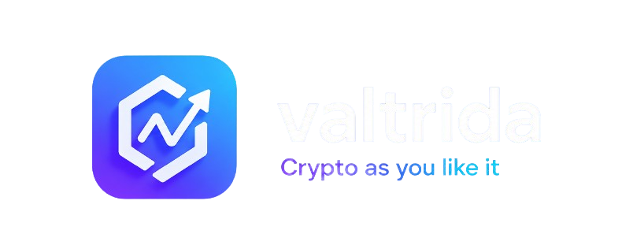
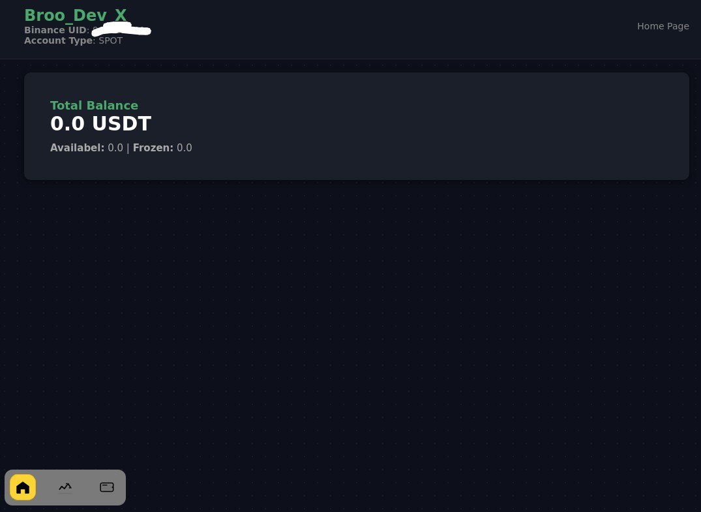
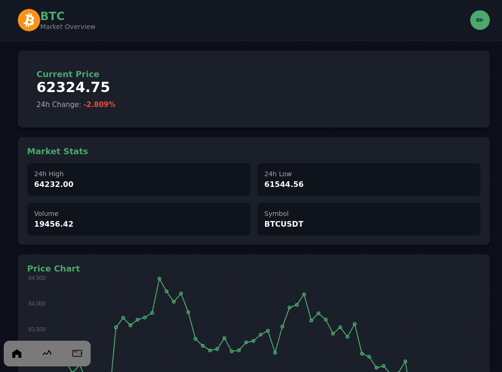
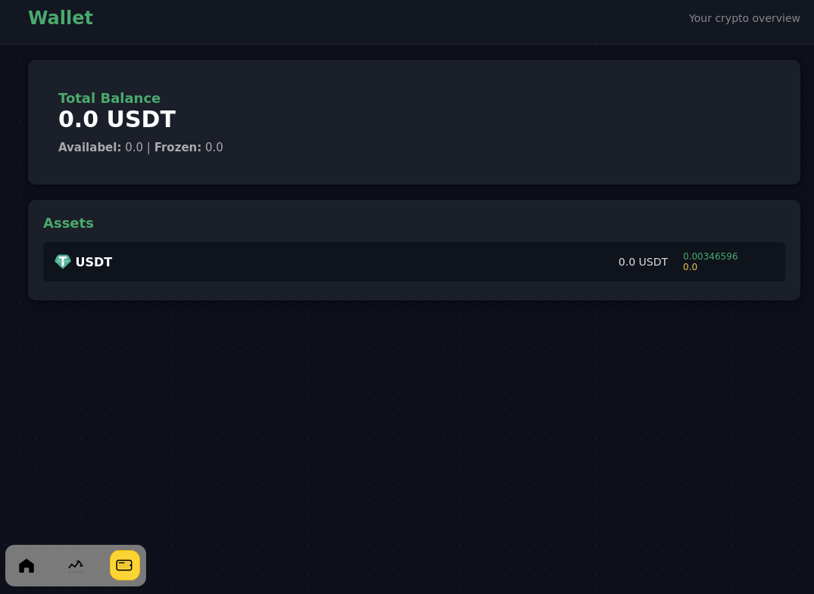
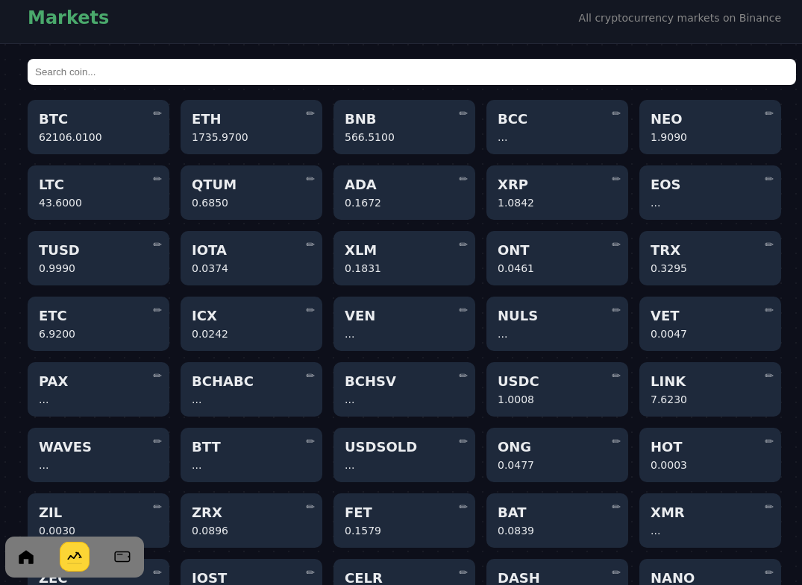
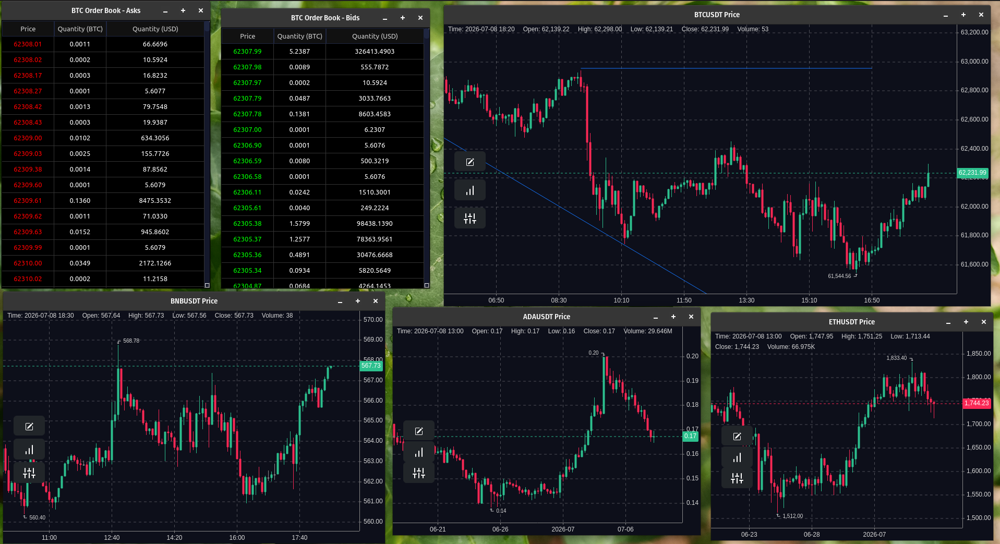

<div align="center">



**A local-first desktop trading terminal for Binance, built with Python and PySide2.**

[](https://www.python.org/)
[-41CD52?logo=qt&logoColor=white)](https://pypi.org/project/PySide2/)
[](https://www.binance.com/)
[](#-security)
[](#-license)
[](#-roadmap)

</div>

---

## Screenshots

<div align="center">

**Main Dashboard**



<br><br>

<table>
<tr>
<td align="center" width="50%">

**Live Charts**



</td>
<td align="center" width="50%">

**Wallet Overview**



</td>
</tr>
<tr>
<td align="center" colspan="2">

**Markets Browser**



</td>
</tr>
<tr>
<td align="center" colspan="2">

**Some Charts**



</td>
</tr>
</table>

</div>


---

## 🔎 Overview

**Valtrida** is a native desktop application for monitoring and trading on **Binance**, built entirely with **Python** and **PySide2 (Qt for Python)**.

It exists to give traders a fast, native, distraction-free alternative to the browser: real-time charts, a wallet overview, and a markets browser, running as a single process on your own machine — no Electron, no bundled browser runtime, no background telemetry.

### Local-first philosophy

Valtrida is built around one non-negotiable principle: **your keys and your data stay on your machine.**

- Binance API credentials are encrypted at rest and only ever decrypted in-memory, locally.
- Market data streams directly between your machine and Binance's own servers.
- There is no Valtrida-operated backend, account system, or analytics collection in the loop — the project has nothing to breach because it holds nothing centrally.

---

## Features

| Category | Description |
|---|---|
| 📈 **Real-time market data** | Live order book and candlestick charts per trading pair, powered by `pyqtgraph`. |
| 💹 **Charts** | Dedicated candlestick chart and order book widgets, updated live via the app's internal event stream — pop any chart out into its own window. |
| 💰 **Wallet overview** | View your Binance spot balances, available vs. frozen amounts, and a simple portfolio breakdown. |
| 🔗 **Binance integration** | Direct REST + WebSocket access to Binance for both public market data and authenticated account data — no intermediary server. |
| 🔒 **Security** | Password-protected local accounts; API secrets encrypted at rest with AES-GCM and a PBKDF2-HMAC-SHA256 derived key. |
| 🎨 **Themes** | Dark and light themes driven by a single source-of-truth color palette, shared across native Qt widgets and embedded HTML/chart views. |
| 🧩 **Architecture** | Event-driven core (`QueueStream`) decouples networking, UI, error handling, and logging, so features can be added without wiring modules directly together. |

---

## Security

Security is a first-class design constraint, not an afterthought:

- **AES-GCM encryption** — Binance API secrets are never written to disk in plaintext. They are encrypted with AES-GCM, an authenticated encryption scheme that protects both confidentiality and integrity of the stored credentials.
- **PBKDF2-HMAC-SHA256 key derivation** — the AES key itself is never stored. It is derived on the fly from your local account password using PBKDF2-HMAC-SHA256 with **200,000 iterations**, making brute-force attacks against a stolen credential file computationally expensive.
- **Local storage only** — all encrypted profiles live under `~/.valtrida/data/users/` on your own filesystem. Nothing is uploaded, synced, or mirrored elsewhere.
- **No third-party servers** — Valtrida has no backend of its own. Every request goes directly from your machine to Binance's official API endpoints, signed locally with your credentials.

> Decryption happens only in-memory, only after a successful local login, and decrypted secrets are never written to logs (see the logging/error-handling conventions in `core/logs.py` and `core/errors.py`).

---

## Getting Started

### Step 1 — Create a Local Account

Choose a username and password to create a new local profile. Nothing is sent anywhere at this stage — the account exists only on your machine.

<details>
<summary>What happens behind the scenes</summary>

Your password is never stored directly. It is run through PBKDF2-HMAC-SHA256 (200,000 iterations) to derive an encryption key, which will later be used to decrypt your Binance credentials. The profile is written to `~/.valtrida/data/users/` as an encrypted file (see `user/local_cypher.py`).

</details>

### Step 2 — Add Your Binance API Keys

Generate an API key from your Binance account (**API Management → Create API Key**) and grant only the permissions you actually need — read-only if you just want to monitor your wallet, trading permissions only if you intend to place orders from Valtrida. Paste the key and secret into the registration screen.

<details>
<summary>What happens behind the scenes</summary>

Your API secret is immediately encrypted with AES-GCM using the key derived in Step 1, then written to your encrypted local profile (`user/widgets/register_via_binance_api.py` → `user/local_cypher.py`). The plaintext secret is never logged and never leaves your machine.

</details>

### Step 3 — Log In and Start Trading

Enter your username and password to unlock your profile. Once authenticated, the main window opens with live markets, charts, and your wallet overview.

<details>
<summary>What happens behind the scenes</summary>

Your password re-derives the decryption key, your Binance credentials are decrypted in-memory only, and the app opens authenticated REST/WebSocket sessions directly to Binance to start streaming market and account data (`API/market.py`, `API/b_accont.py`).

</details>

For the full walkthrough, including troubleshooting, see [`USAGE.md`](USAGE.md).

---

## Installation

### Clone the Repository

```bash
git clone https://github.com/<your-org>/valtrida.git
cd valtrida
```

### Install Dependencies

> Note: the dependencies file is named `requirements.txt` (existing typo in the repo, not a documentation error).

```bash
pip install -r requirements.txt
cd Program
```

Key dependencies: **PySide2** (UI), **pyqtgraph** (charts), **cryptography** (local encryption), and a Binance client library.

### Run the Application

```bash
python index.py
```

Requires Python 3.8+ and a graphical desktop environment (Linux, Windows, or macOS) — Valtrida is a native GUI app, not a web app.

---

## 🛠 Tech Stack

| Layer | Technology |
|---|---|
| UI Framework | PySide2 (Qt for Python) |
| Charts | pyqtgraph |
| Exchange | Binance REST + WebSocket API (via `python-binance` / `uniquant`, see `requirements.txt`) |
| Concurrency | Python `threading`, custom async/task controller |
| Local storage | Flat encrypted files under `~/.valtrida/` |
| Cryptography | `cryptography` (AES-GCM, PBKDF2-HMAC-SHA256) |
| Styling | QSS (native widgets) + CSS (embedded HTML/QtWebEngine views) |

---

## 🏗 Architecture

Valtrida is a single-process desktop application built around an event-driven core rather than direct module-to-module calls.

- **Event-driven design & `QueueStream`** — instead of modules calling each other's methods directly, a lightweight publish/subscribe primitive (`base/utils.py`) connects them. Four global streams act as the app's nervous system: `SystemStream`, `UserStream`, `ErrorsStream`, and `LogsStream` (`core/async_controller.py`). `streams.txt` is the authoritative schema for every event name and payload shape.
- **UI Layer** (`windows/`, `charts/`, `Styles/`) — Qt windows and widgets subscribe to streams to update live, rather than polling or being called directly by the networking layer.
- **Binance Layer** (`API/`) — `API/market.py` handles public market data; `API/b_accont.py` handles authenticated account data. Both talk to Binance directly; there is no Valtrida-operated backend.
- **Storage Layer** (`core/folders.py`, `base/files_folders.py`) — manages the local `~/.valtrida/` directory structure where all persistent state (encrypted user profiles, icon assets) lives.
- **Authentication Layer** (`user/`) — local account registration and login, plus AES-GCM/PBKDF2-based encryption of Binance credentials (`user/local_cypher.py`).

Coordinated startup and shutdown are handled by the `AsyncController` (`core/async_controller.py`), which tracks every window, background thread, scheduled task, and open Binance session so they can all be cleanly torn down together.

For the full deep-dive — including the `base/` registry pattern used to avoid circular imports, and documented known issues — see [`DOCS/ARCHITECTURE.md`](DOCS/ARCHITECTURE.md).

---

## Project Structure

```
valtrida/
├── index.py              # Application entry point
├── prepare.py             # Bootstrap: folders, config, event streams, pre-flight checks
├── config.py               # Global runtime configuration (e.g. COLOR_MODE)
├── streams.txt             # Authoritative reference for the internal event/stream schema
├── requirements.txt          # Python dependencies (note: filename typo, kept as-is)
│
├── Program/
    │
    ├── API/                    # Binance REST/WebSocket access layer
    │   ├── market.py             # Public market data (prices, candlesticks, order book)
    │   └── b_accont.py           # Authenticated account data (balances, orders)
    │
    ├── base/                   # Shared, import-cycle-free registries & utilities
    │   ├── charts.py              # Chart-type registry
    │   ├── tool_bar.py            # Tool bar tab registry
    │   ├── user_data.py           # In-memory session/user data
    │   ├── utils.py                # QueueStream / QueueStreamChannel pub-sub primitives
    │   └── files_folders.py       # Local path constants
    │
    ├── core/                   # Application core: cross-cutting concerns
    │   ├── async_controller.py    # Global streams + AsyncController (lifecycle management)
    │   ├── errors.py                # Centralized error stream handling
    │   ├── folders.py               # Local data directory setup
    │   └── logs.py                   # Logging stream consumer
    │
    ├── charts/                 # pyqtgraph-based chart widgets
    │   ├── candels_shart.py       # Candlestick chart
    │   └── order_book.py           # Order book widget
    │
    ├── windows/                # Qt windows/screens
    │   ├── main.py                 # Main application window
    │   ├── coin.py                  # Per-coin detail window (chart + order book)
    │   ├── chart_popup.py          # Standalone popped-out chart window
    │   └── tool_bar/                # Navigation bar tabs (home, markets, wallet)
    │
    ├── user/                   # Authentication & local security
    │   ├── local_cypher.py         # AES-GCM / PBKDF2 credential encryption
    │   ├── window.py                 # Authentication window
    │   └── widgets/                  # Login & Binance API registration widgets
    │
    └── Styles/                 # Theming
        ├── qss.py                     # Qt widget stylesheets (QSS)
        ├── css.py                      # CSS for embedded HTML views
        ├── icons.py                    # Base64-embedded icon assets
        ├── mods.py                     # Dark → light stylesheet transformation
        └── plot_styles.py              # pyqtgraph chart theming
```

---

## Documentation

Full developer documentation — one page per source file, plus architecture notes — lives in [`DOCS/`](DOCS/README.md).

| Resource | Description |
|---|---|
| [`DOCS/README.md`](DOCS/README.md) | Documentation index |
| [`DOCS/ARCHITECTURE.md`](DOCS/ARCHITECTURE.md) | How the app fits together (streams, registries, controller, storage layout) |
| [`USAGE.md`](USAGE.md) | Running the app and day-to-day usage |
| [`CONTRIBUTING.md`](CONTRIBUTING.md) | How to contribute, code conventions, known quirks |

---

- [ ] Plugin SDK and marketplace support
- [ ] Multi-process window architecture to reduce GIL contention
- [ ] Additional exchange integrations
- [ ] Advanced order-flow indicators

For ideas and feature requests, see [CONTRIBUTING.md](CONTRIBUTING.md).

> This roadmap reflects known rough edges tracked in [`DOCS/ARCHITECTURE.md`](DOCS/ARCHITECTURE.md#known-issues) — contributions toward any of these are welcome.

---

## Contributing

Contributions are welcome. Before opening a PR:

1. Read [`CONTRIBUTING.md`](CONTRIBUTING.md) for coding conventions, the event-driven/registry architecture rules, and known issues to be aware of.
2. Keep changes focused — one concern per PR (e.g. don't mix a typo fix with a feature).
3. If you add a new stream event, update `streams.txt`. If you add a new source file, add a matching page under `DOCS/`.
4. Manually verify `python index.py` still launches and the screens you touched still work — there is currently no automated UI test suite.

---

## 📄 License

You can see lisence and rules on [`LICENSE`](LICENSE)

<div align="center">

Built with Python, Qt, and a local-first philosophy.

</div>