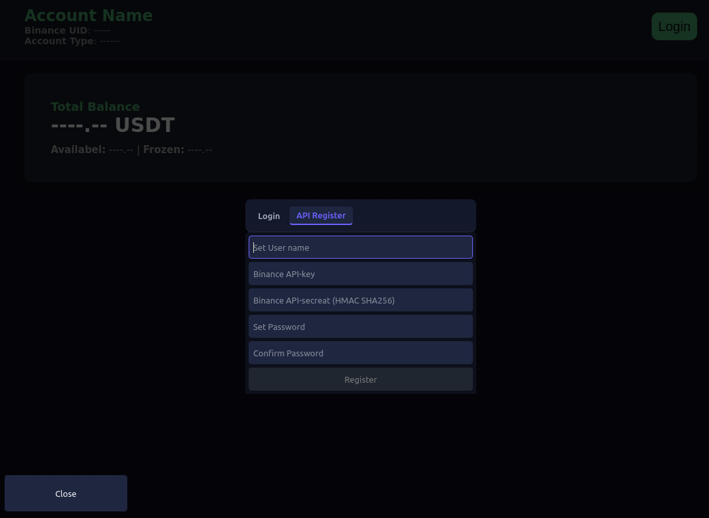
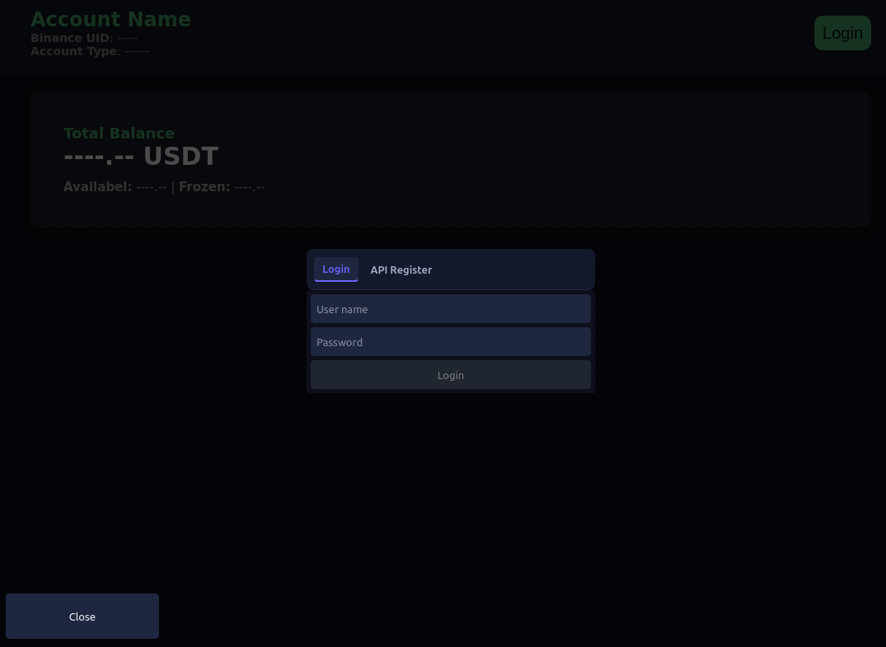

# Usage Guide

This guide covers installing, running, and using Valtrida day-to-day.

## 1. Requirements

- Python 3.8+ (PySide2 requires a CPython build; check your installed version with `python --version`)
- A Binance account (only needed if you want live wallet/trading data — market data for charts can be viewed without one, depending on which screens you use)
- Linux, Windows, or macOS with a graphical desktop (this is a native GUI app, not a web app)

## 2. Installation

Install dependencies from the requirements file (note: the file is named `requirements.txt`, not `requirements.txt` — this is an existing typo in the repo, not a documentation error):

```bash
pip install -r requirements.txt
cd Program
```

Key dependencies include PySide2 (UI), pyqtgraph (charts), `cryptography` (local encryption), and a Binance client library (`uniquant`, listed in `requirements.txt`).

## 3. First Run

Start the app from the project root:

```bash
python index.py
```

On first launch, `prepare.py` runs automatically before the UI appears. It:

1. Creates the local application data directory at `~/.valtrida/` (see `core/folders.py` and `base/files_folders.py`) if it doesn't exist — this includes subfolders for user data, assets/icons, and (reserved for future use) plugins.
2. Initializes global configuration from `config.py` (e.g. `COLOR_MODE` for dark/light theming).
3. Sets up the core event streams and the `AsyncController` that will track background threads and network sessions for the session.
4. Opens the authentication window (`user/window.py`).

## 4. Creating an Account / Logging In

Valtrida stores accounts **locally only** — there is no central server account system.

- **Register**: Create a new local profile with a username/password. If you want to connect your Binance account, you'll be asked for your Binance API key and secret (see `user/widgets/register_via_binance_api.py`). These are encrypted before being written to disk (see `user/local_cypher.py`) and stored under `~/.valtrida/data/users/` as a per-user encrypted file.
- **Login**: Enter your local username and password (see `user/widgets/login.py`). The password is used to derive the decryption key for your stored API credentials — it is never sent anywhere.

<div align="center"> <table> <tr>

<td align="center" width="50%">

**Register**


</td>
<td align="center" width="50%">

**Login**


</td>

</tr> </table> </div>

> Your Binance API secret never leaves your machine. It is only used locally to sign requests made directly to Binance's servers.

### Creating a Binance API key (if you don't have one)

1. Log into binance.com → API Management.
2. Create a new API key.
3. Grant only the permissions you need (e.g. "Enable Reading", and "Enable Spot & Margin Trading" only if you intend to place orders from Valtrida).
4. Copy the API Key and Secret Key into Valtrida's registration screen. Binance only shows the secret once — store it safely elsewhere as a backup.

## 5. Main Screens

| you need't to login to use the app, it just for chowing balances from your binance wallet

The main window (`windows/main.py`) presents a navigation tool bar (`windows/tool_bar/`) with:

- **Home** (`windows/tool_bar/home.py`) — overview/landing screen.
- **Markets** (`windows/tool_bar/markets.py`) — search and browse trading pairs; click a pair to open its detail window (`windows/coin.py`) with a live candlestick chart and order book.
- **Wallet** (`windows/tool_bar/wallet.py`) — view your Binance spot balances (available vs. frozen) and a simple portfolio breakdown.

Charts (`charts/candels_shart.py`, `charts/order_book.py`) update live as new data arrives over the app's internal event streams (see [`DOCS/ARCHITECTURE.md`](DOCS/ARCHITECTURE.md)).

You can also pop a chart out into its own window via `windows/chart_popup.py`.

## 6. Switching Theme (Dark/Light)

The color mode is controlled by `COLOR_MODE` in `config.py`. Changing it and restarting the app switches all QSS/CSS styling and chart colors between the dark palette (default) and the light palette (mapped 1:1 in `Styles/__init__.py`'s `DARK_TO_LIGHT_COLORS`).

## 7. Shutting Down

Closing the main window triggers the app's coordinated shutdown path (`AsyncController.CRITICAL_STOP()` in `core/async_controller.py`), which stops background threads, closes network sessions, and closes any open windows before the process exits. Prefer closing the app normally over killing the process, so in-flight requests and threads are cleaned up.

## 8. Troubleshooting

- **App won't start / import errors**: confirm all dependencies from `requirements.txt` are installed for the Python interpreter you're running.
- **Icons/arrows missing in dropdowns**: `Styles/qss.py` contains a hardcoded absolute path to an icon (`/home/broo-dev/.valtrida/.../arrow-down.svg`) that only exists on the original developer's machine. See the "Known Issues" section of [`DOCS/ARCHITECTURE.md`](DOCS/ARCHITECTURE.md) for details — this is a portability bug, not a sign your install is broken.
- **Binance requests failing**: double-check your system clock is in sync (Binance rejects signed requests with too much time drift) and that your API key permissions match what the app is trying to do.

## 9. Chow any Chart

To chow any chart like picture in [`RAEDME.md`](RAEDME.md), you need to
- **Go To Markets window**: in tool bar from in main window, you will fond a button by name markets, click it.
- **From the Market window**: If you lock to any card od pair, you will found a mall pen, click on them and you get Chow Charts popup window.
- **From coin detail**: If you enter to any coin detail, you will found a button it top bar (pen picture), click on them, you will get Chow Charts popup window.
- **In Chow Chart window**: You will see in this page some of settings, first chow your chart (candals and orderbook are defaults), change all settings that you need, and charts will appear on your desktop like a separate window 
